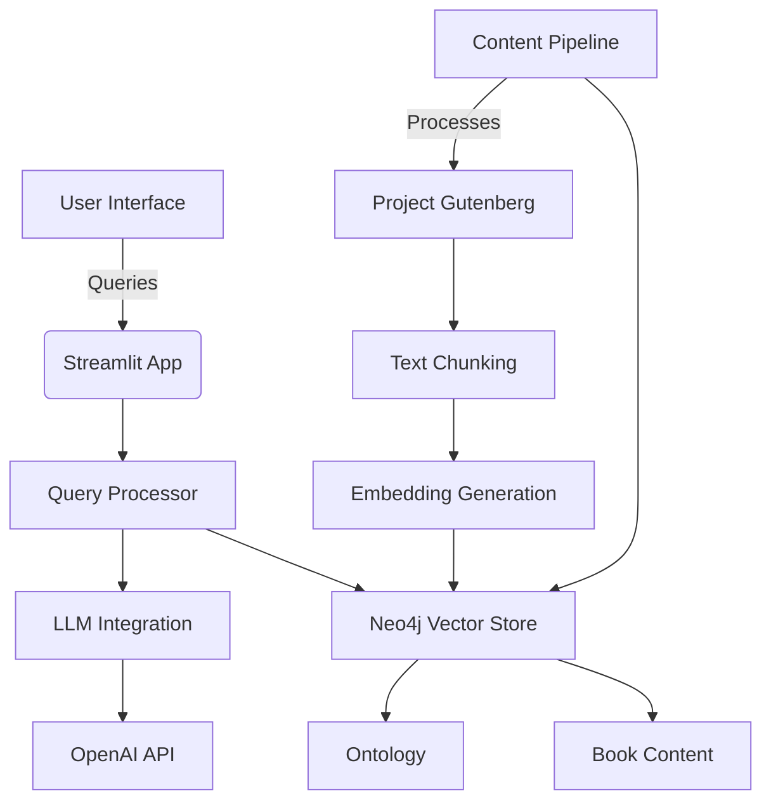

# Knowledge Navigator

A comprehensive knowledge exploration system that enables:
- Automated ontology generation from text
- Semantic search and question answering
- Configurable for any text source
- Vector database storage (Neo4j)
- Streamlit-based interactive interface

Primary data source: [Pride and Prejudice from Project Gutenberg](https://www.gutenberg.org/cache/epub/1342/pg1342.txt)

## Core Functionality

### 1. Content Processing Pipeline
- **Text Ingestion**: Downloads and processes book text from Project Gutenberg
- **Chunking**: Splits text into meaningful segments using semantic boundaries
- **Embedding**: Generates vector representations using OpenAI embeddings
- **Storage**: Stores processed content in Neo4j with full-text search capabilities

### 2. Knowledge Extraction
- **Ontology Generation**: Automatically identifies key entities and relationships
- **Entity Recognition**: Extracts characters, locations, and key concepts
- **Relationship Mapping**: Builds knowledge graph of book elements

### 3. Query Processing
- **Natural Language Understanding**: Interprets user questions
- **Context Retrieval**: Finds relevant text passages using vector similarity
- **Response Generation**: Combines retrieved context with LLM capabilities

### 4. User Interface
- **Streamlit Dashboard**:
  - Book content visualization with entity highlighting
  - Natural language query interface
  - Response explanation with source citations
  - Interactive ontology explorer
  - Configuration panel for book sources

## Implementation Details

**AI Assistant Usage**:
- Used BlackBoxChat for code completion and pattern suggestions
- Employed ChatGPT-4 for architecture design validation
- Selection criteria: Accuracy of Python/Neo4j integration knowledge
- Prompt strategy: Iterative refinement with specific technology constraints

**Assumptions**:
1. Default book: Pride and Prejudice (Project Gutenberg)
2. Vector DB: Neo4j with text embedding support
3. OpenAI API for embeddings and LLM responses
4. Python 3.9+ environment

## Installation

1. Clone the repository:
```bash
git clone [repository_url]
cd knowledge_navigator
```

2. Create and activate a virtual environment:
```bash
python -m venv venv
source venv/bin/activate  # On Windows use `venv\Scripts\activate`
```

3. Install dependencies:
```bash
pip install -r requirements.txt
```

## Configuration

1. Set up environment variables in `.env`:
```
# Neo4j Configuration
NEO4J_URI=your_neo4j_uri
NEO4J_USER=your_username
NEO4J_PASSWORD=your_password

# OpenAI Configuration
OPENAI_API_KEY=your_openai_key

# Book Configuration (override default)
BOOK_URL=https://www.gutenberg.org/cache/epub/1342/pg1342.txt
```

2. Configuration is managed through `project/config/environment.py`

## Usage

### Running the Application
```bash
streamlit run project/streamlit_app.py
```

### Testing with Different Books
1. Update BOOK_URL in the UI.
2. And process the book again.
3. The system will automatically:
   - Download new text
   - Rebuild ontology
   - Process and store chunks

## System Architecture

### High-Level Overview


### Component Breakdown

#### 1. Frontend Layer
- **Streamlit Web Interface**:
  - Interactive query input
  - Response visualization with citations
  - Ontology exploration dashboard
  - Configuration management

#### 2. Application Services
- **Query Processing**:
  - Natural language understanding
  - Context retrieval from vector store
  - Response generation with LLM
- **RAG Pipeline**:
  - Document processing and chunking
  - Vector embedding generation
  - Knowledge graph construction
- **Book Processing**:
  - Text ingestion and cleaning
  - Metadata extraction
  - Content normalization

#### 3. Data Layer
- **Neo4j Graph Database**:
  - Vector index for semantic search
  - Knowledge graph storage
  - Full-text search capabilities
- **External Services**:
  - OpenAI API for embeddings/LLM
  - Project Gutenberg for book content

### API Endpoints

#### 1. `/status` (GET)
- **Purpose**: Health check and service status monitoring
- **Response**:
  ```json
  {
    "status": "running",
    "version": "1.0.0",
    "uptime": "2h 15m",
    "database": "connected"
  }
  ```
- **Parameters**: None
- **Authentication**: None required
- **Usage**: 
  ```bash
  curl http://localhost:8000/status
  ```

#### 2. `/welcome` (GET)
- **Purpose**: Returns a welcome message with system information
- **Response**:
  ```json
  {
    "message": "Welcome to the Knowledge Navigator System",
    "system": {
      "book_loaded": "Pride and Prejudice",
      "chunks_processed": 1428,
      "entities_extracted": 287
    }
  }
  ```
- **Parameters**: None
- **Authentication**: None required
- **Usage**:
  ```bash
  curl http://localhost:8000/welcome
  ```

### Implementation Structure
- `config/environment.py`: Central configuration management
  - Handles environment variables and default settings

### Data Models (`models/`)
- `neo4j_model.py`: Manages graph database operations
  - Node and relationship creation
  - Vector index management
  - Query execution
- `openai_model.py`: Handles LLM interactions
  - Embedding generation
  - Completion requests
  - Token management

### Processing Pipelines (`pipelines/`)
- `rag_chain_pipeline.py`: Core RAG implementation
  - Document loading and splitting
  - Embedding generation
  - Vector storage
  - Query processing
  - Response generation

### Business Services (`services/`)
- `book_service.py`: Manages book content
  - Text downloading
  - Preprocessing
  - Metadata extraction
- `ontology_service.py`: Handles knowledge extraction
  - Entity recognition
  - Relationship extraction
  - Graph construction

### Utilities (`utils/`)
- `helpers.py`: Common utility functions
- `logging_setup.py`: Centralized logging configuration

### Entry Points
- `main.py`: CLI interface for batch processing
- `streamlit_app.py`: Web interface for interactive use

## Dependencies

Key dependencies (see requirements.txt for complete list):
- streamlit
- neo4j
- openai
- python-dotenv
- langchain (for RAG pipeline)


## Further Possible Enhancements

- **Ontology-Guided Retrieval**: Extract entities and themes from user queries using an LLM and use them to filter relevant content from the Neo4j graph before passing to the LLM for answer generation.

- **Hybrid Context Generation**: Combine results from vector similarity search and ontology-based graph queries to enrich the context provided to the LLM, improving response relevance and accuracy.
